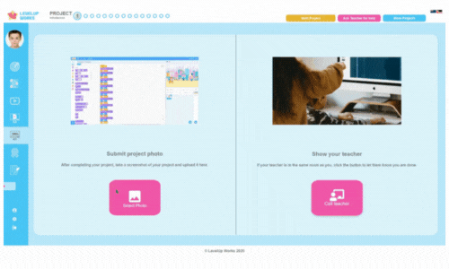

### Hi there 👋
I'm Adam, a full-stack developer student currently studying with [Mission Ready HQ](https://www.missionreadyhq.com/)

Over the last 6 months I've been honing my skills working on frontend, backend, and full-stack projects with a foundation in JavaScript, React, and Node.JS, and a theme of AI/LLM integration.

Most recently, projects I've been working on include:
1. A cloud-based app. to recognise and categorise motor vehicles - MS Azure, Azure Custom Vision
2. An AI powered chatbot 'interviewer' for users to practice job interviews in any chosen professions with server saved and recallable 'sessions' - Gemini LLM API
3. An AI powered chatbot to provide advice on car insurance policies for users. - Gemini LLM API
4. A mock Service Station locator app, with service filtering and map integration.

  
  
  
  
  

🔭 I'm currently working on a 'learning-app' to track and catalogue my learning journey, or to help anyone learn something new. 

I'm located in New Zealand. You can find me on:
- [LinkedIn](https://www.linkedin.com/in/adam-tung-95b25650/)

<!--
**AdamT-HJ/AdamT-HJ** is a ✨ _special_ ✨ repository because its `README.md` (this file) appears on your GitHub profile.

Here are some ideas to get you started:

- 🔭 I’m currently working on ...
- 🌱 I’m currently learning ...
- 👯 I’m looking to collaborate on ...
- 🤔 I’m looking for help with ...
- 💬 Ask me about ...
- 📫 How to reach me: ...
- 😄 Pronouns: ...
- ⚡ Fun fact: ...
-->
